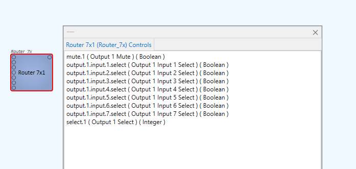
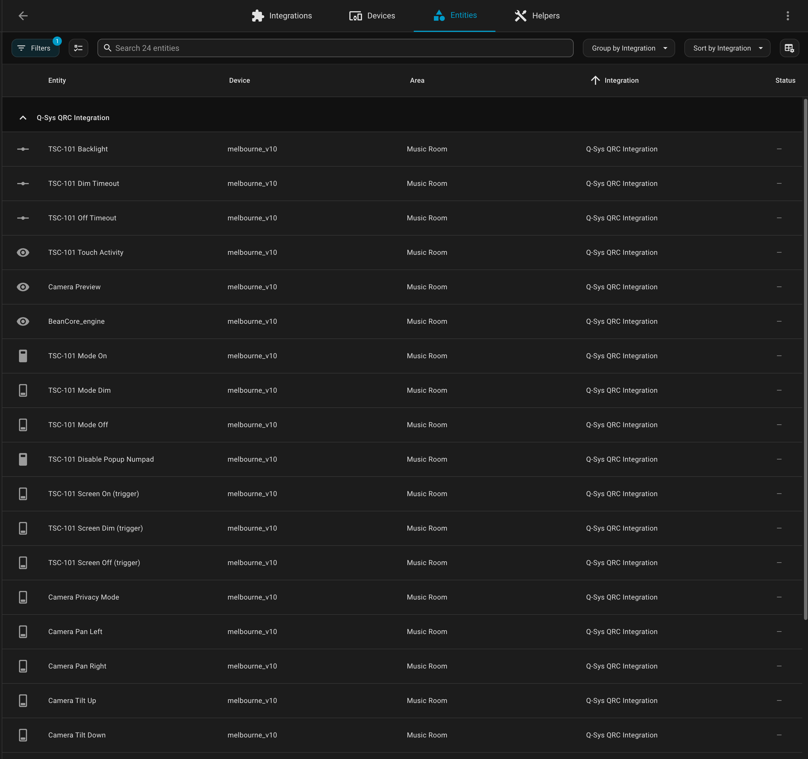

# Home Assistant Q-SYS™ Remote Control Protocol (QRC)

[![GitHub Release][releases-shield]][releases]
[![GitHub Activity][commits-shield]][commits]
[![License][license-shield]](LICENSE.md)
[![hacs][hacsbadge]][hacs]
[![Community Forum][forum-shield]][forum]

Note: This is a work in progress, but should work. If it doesn't, please open an issue.

A custom component that integrates Q-Sys Core Devices with Home Assistant via [QRC](https://q-syshelp.qsc.com/Index.htm#External_Control_APIs/QRC/QRC_Overview.htm). This is useful to expose elements such as gain controls, mute buttons and different media players to HA.

### Features

- `media_player` platform:
  - [Media Stream Receivers/ URL Receivers](https://q-syshelp.qsc.com/Index.htm#Schematic_Library/URL_receiver.htm)
    - On/Off (Enable/Disable)
    - Mute control
    - Volume control (stereo channels)
    - Browse media
    - Play media
  - [Audio Player / Audio File Player](https://q-syshelp.qsc.com/Index.htm#Schematic_Library/audio_file_player.htm)
    - On/Off (Enable/Disable)
    - Mute control
    - Volume control
    - Browse media (files on the Core)
    - Play media (files on the Core)
    - Seek
    - Loop on/off

- `number` platform:
  - `Value` controls (e.g gains)
    - Direct control (setting Value directly)
    - Position control (0.0 to 1.0)
    - Custom mapping via templated changes/values.

- `sensor` platform:
  - `EngineStatus` exposed to HA
  - Any component control

- `switch` platform:
  - Any float/int/bool where 1.0/1/True is considered on respectively
  - Toggling.

- `text` platform:
  - `String` controls.

- `select` platform:
  - Q-Sys controls with a `Choices` list (e.g. multi-state buttons, source selectors).
  - Options auto-populate from QRC; pin a static `options:` list in YAML to override.

- **Top-level Named Controls:**
  - For switch / number / sensor / text / select entries, omit the
    `component:` key and the integration treats `control:` as a top-level
    Q-Sys Named Control (i.e., entries in the Named Controls panel that
    aren't pinned to a scriptable component). Existing component-backed
    configs keep working unchanged.

- `services`:
  - Invoking methods on the device via QRC (see `Services` section below)

### Installing

Add the custom component via your `custom_components` folder or via HACS (untested).

#### Via HACS

1. Install HACS
1. Open HACS in the sidebar and go to "Integrations".
1. Press the three dots in the top right corner and select "Custom repositories"
1. Fill in the form with `Repository: https://github.com/nkvoll/home-assistant-qsys-qrc`, `Category: Integration` and click "Add".
1. Once it's added, you can search for `q-sys qrc`, click the integration and select "Download".
1. Restart Home Assistant ("Settings" -> three dots top right corner -> "Restart Home Assistant")
1. In the HA UI go to "Configuration" -> "Devices & Services" click "+ Add Integration" (bottom right corner) and search for "Q-Sys QRC Integration"

#### Manual installation

1. Using the tool of choice open the directory (folder) for your HA configuration (where you find `configuration.yaml`).
1. If you do not have a `custom_components` directory (folder) there, you need to create it.
1. In the `custom_components` directory (folder) create a new folder called `qsys_qrc`.
1. Download _all_ the files from the `custom_components/qsys_qrc/` directory (folder) in this repository.
1. Place the files you downloaded in the new directory (folder) you created.
1. Restart Home Assistant ("Settings" -> three dots top right corner -> "Restart Home Assistant")
1. In the HA UI go to "Configuration" -> "Devices & Services" click "+ Add Integration" (bottom right corner) and search for "Q-Sys QRC Integration"

### Configuring

First, set up the integration through the UI to configure the core name and credentials.

To expose component controls to HA, configure them via the configuration file (`configuration.yaml`).

See [the example configuration](examples/configuration.yaml) for an example of what can be configured.

In order to find the right component and control names, use the [Q-Sys Designer](https://www.qsc.com/resources/software-and-firmware/q-sys-designer-software/). To find the right control name, open the design file and use “Tools → View Component Controls Info” then select your component. See example screenshot.



### Named Controls (no component backing)

Q-Sys designs often expose top-level **Named Controls** — entries in the
Named Controls panel that aren't bound to a scriptable component. These are
reachable via QRC's `Control.Get` / `Control.Set`, and this lets you
map them to HA entities by **omitting the `component:` key** in YAML.

Here's a real install — 23 Named Controls from a `melbourne_v10` design (touchscreen mode/timeouts, PTZ camera buttons, screen brightness) all loaded as switches, numbers, and sensors under one Q-Sys QRC device:



```yaml
qsys_qrc:
  cores:
    MainCore:
      platforms:
        switch:
          - name: "Apple Power"
            control: "Apple.Power" # top-level Named Control
          - name: "Roon Mute"
            control: "Roon.Mute"

        number:
          - name: "Roon Volume"
            control: "Roon.Volume"
            unit_of_measurement: "dB"
            min: -80
            max: 0
            step: 1

        select:
          - name: "Apple Lights"
            control: "Apple.Lights" # options auto-populated from Choices

        text:
          - name: "Hue Lights"
            control: "Hue.Lights"

        sensor:
          - name: "Roon Now Playing"
            control: "Text_ControllerNowPlaying_Text"
            attribute: "String"
```

Component-backed entries (the original style) keep working unchanged
alongside top-level entries.

To enumerate the Named Controls a Core exposes, you can call
`Control.Get` with the `qsys_qrc.call_method` service (see below) using
a flat list of names — or omit `Component.GetComponents` and look at the
Named Controls panel in Q-Sys Designer.

### Services

### `call_method` Service

Used to call any method via [QRC Commands](https://q-syshelp.qsc.com/Index.htm#External_Control_APIs/QRC/QRC_Commands.htm):

#### Example: setting a gain control:

```yaml
service: qsys_qrc.call_method
data:
  device_id: 7b7be23f1d37293589c28bee4dbb5b4d
  method: Component.Set
  params:
    Name: bathroom_f2_gain
    Controls:
      - Name: gain
        Position: 0.5
        Ramp: 2
```

#### Example: setting a mute control:

```yaml
service: qsys_qrc.call_method
data:
  device_id: 7b7be23f1d37293589c28bee4dbb5b4d
  method: Component.Set
  params:
    Name: bathroom_f2_gain
    Controls:
      - Name: mute
        Value: true
```

### Example: setting a mixer crosspoint mute:

```yaml
service: qsys_qrc.call_method
data:
  device_id: 7b7be23f1d37293589c28bee4dbb5b4d
  method: Mixer.SetCrossPointMute
  params:
    Name: main_mixer
    Inputs: "*"
    Outputs: "*"
    Value: true
```

### TODO

- Add (more) tests, especially around the code that integrates with home-assistant itself, see [`pytest-homeassistant-custom-component`](https://github.com/MatthewFlamm/pytest-homeassistant-custom-component) to get started.
- Share the integration on the [Home Assistant Forum](https://community.home-assistant.io/).
- Anything else?

### Contributions are welcome!

If you want to contribute to this please read the [Contribution guidelines](CONTRIBUTING.md)

### Acknowledgements

- [@itskevinb](https://github.com/itskevinb) Support for top-evel Q-Sys Named Controls (the entries in the Named Controls panel that aren't backed by a scriptable component) and a new `select` platform for controls with a `Choices` list and more.

### Trademarks

This Home Assistant custom integration is not endorsed or affiliated with QSC, LLC.

- QSC and the QSC logo are registered trademarks of QSC, LLC in the U.S. Patent and Trademark Office and other countries.
- QSC, the QSC logo and (Name) are registered trademarks of QSC, LLC in the U.S. Patent and Trademark Office and other countries.
- Q-SYS is a trademark of QSC, LLC.

---

[commits-shield]: https://img.shields.io/github/commit-activity/y/nkvoll/home-assistant-qsys-qrc.svg?style=for-the-badge
[commits]: https://github.com/nkvoll/home-assistant-qsys-qrc/commits/main
[hacs]: https://github.com/hacs/integration
[hacsbadge]: https://img.shields.io/badge/HACS-Custom-orange.svg?style=for-the-badge
[forum-shield]: https://img.shields.io/badge/community-forum-brightgreen.svg?style=for-the-badge
[forum]: https://community.home-assistant.io/
[license-shield]: https://img.shields.io/github/license/nkvoll/home-assistant-qsys-qrc.svg?style=for-the-badge&bust=123
[releases-shield]: https://img.shields.io/github/release/nkvoll/home-assistant-qsys-qrc.svg?style=for-the-badge
[releases]: https://github.com/nkvoll/home-assistant-qsys-qrc/releases
