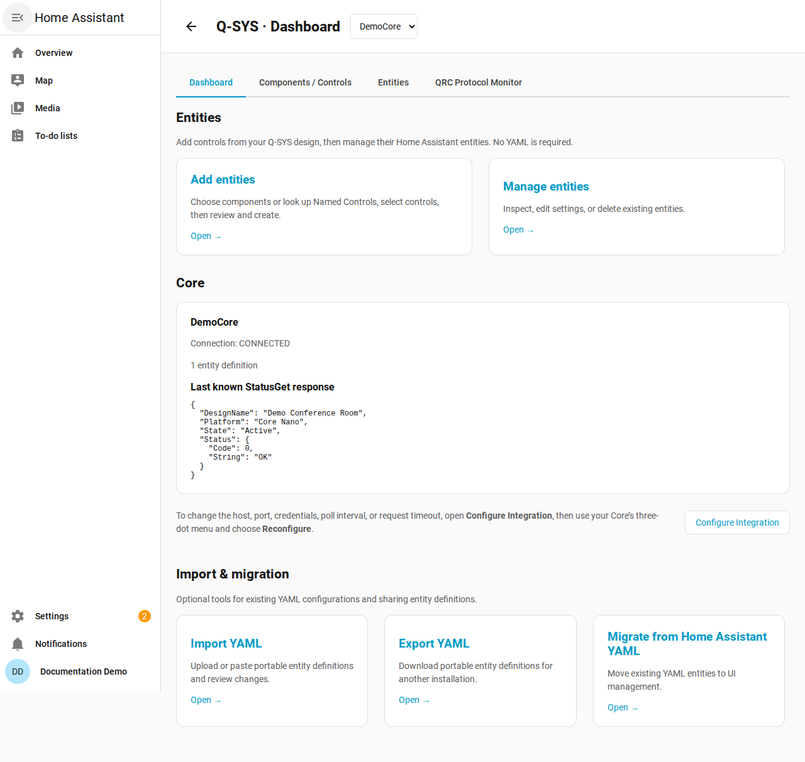
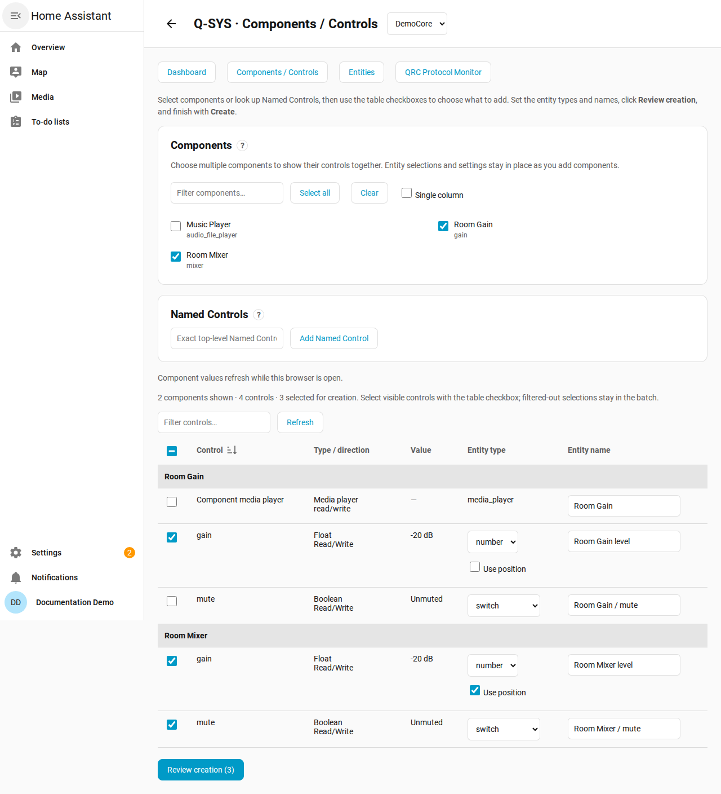
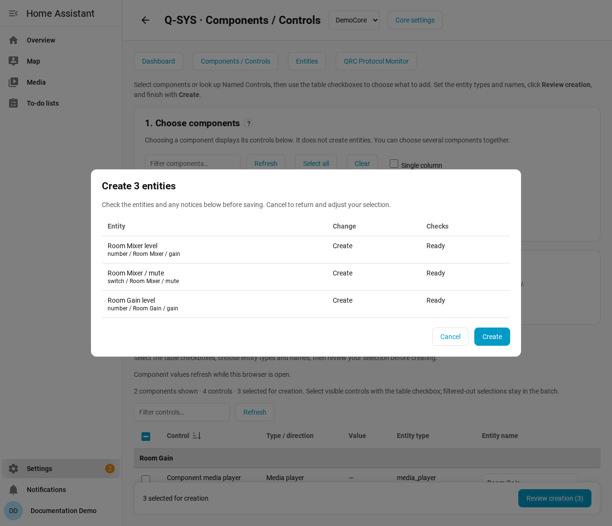
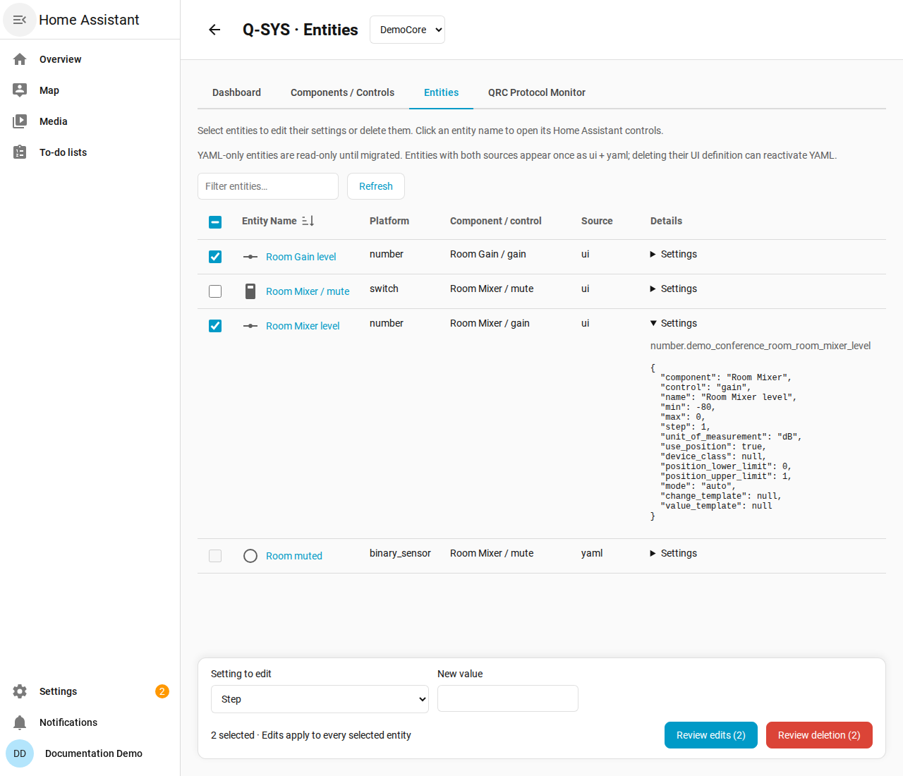
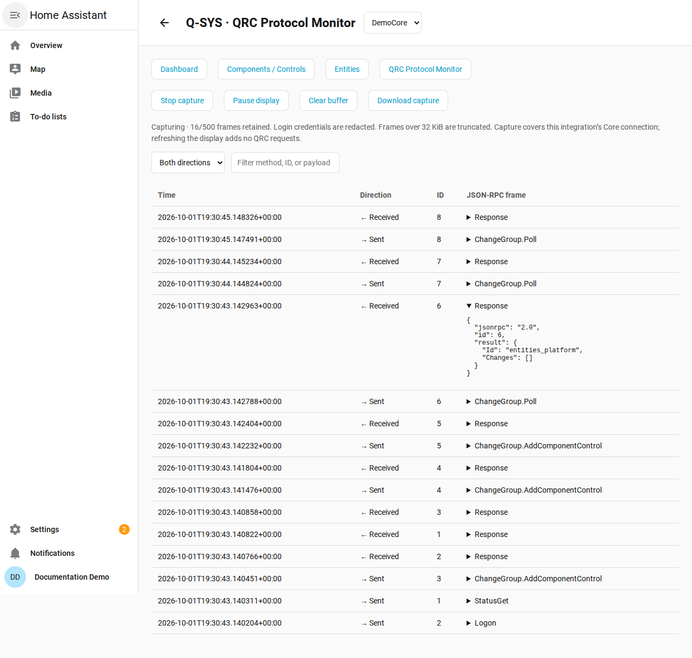
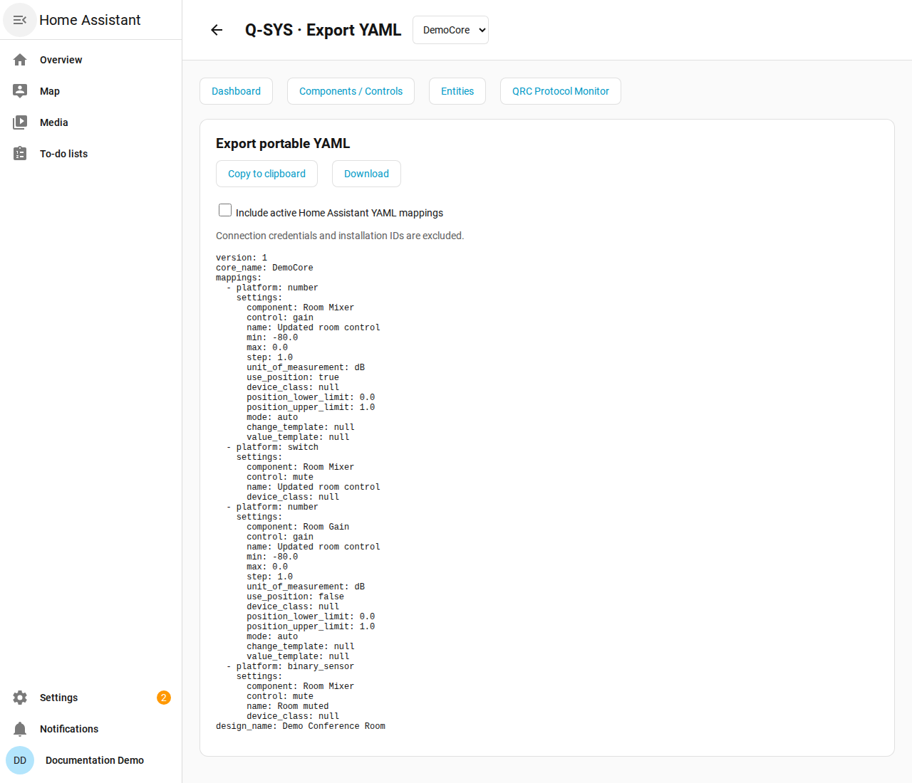

# Home Assistant Q-SYS™ Remote Control Protocol (QRC)

[![GitHub Release][releases-shield]][releases]
[![GitHub Activity][commits-shield]][commits]
[![License][license-shield]](LICENSE.md)
[![hacs][hacsbadge]][hacs]
[![Community Forum][forum-shield]][forum]

A custom integration that connects Q-SYS Core devices to Home Assistant via [QRC](https://q-syshelp.qsc.com/Index.htm#External_Control_APIs/QRC/QRC_Overview.htm). It exposes Q-SYS components/controls and media players as Home Assistant entities, letting you monitor their state, control them from dashboards, and include them in automations.

### Features

- **Q-SYS management UI:** open **Settings → Connectivity → Q-SYS** to browse
  components and controls, create entities in batches, edit or delete mappings,
  monitor QRC traffic, and import, export, or migrate YAML configuration.

- `media_player` platform:
  - [Media Stream Receivers/ URL Receivers](https://q-syshelp.qsc.com/Index.htm#Schematic_Library/URL_receiver.htm)
    - On/Off (Enable/Disable)
    - Mute control
    - Volume control (stereo channels)
    - Browse media
    - Play media
  - [Audio Player / Audio File Player](https://q-syshelp.qsc.com/Index.htm#Schematic_Library/audio_file_player.htm)
    - On/Off (Enable/Disable)
    - Mute control
    - Volume control
    - Browse media (files on the Core)
    - Play media (files on the Core)
    - Seek
    - Loop on/off

- `number` platform:
  - `Value` controls (e.g gains)
    - Direct control (setting Value directly)
    - Position control (0.0 to 1.0)
    - Custom mapping via templated changes/values.

- `sensor` platform:
  - `EngineStatus` exposed to HA
  - Any component control

- `binary_sensor` platform:
  - Read-only Boolean state such as mute, bypass, or switch indicators.
  - Boolean values and numeric 0/1 are supported; other values show unknown.
  - Supports optional Home Assistant binary-sensor device classes.

- `switch` platform:
  - Any float/int/bool where 1.0/1/True is considered on respectively
  - Toggling.

- `text` platform:
  - `String` controls.

- `select` platform:
  - Q-Sys controls with a `Choices` list (e.g. multi-state buttons, source selectors).
  - Options auto-populate from QRC; pin a static `options:` list in YAML to override.

- **Named Controls:**
  - Look up exact names in the panel’s **Named Controls** box and create switch,
    number, sensor, binary_sensor, text, or select entities.
  - In Home Assistant YAML, omit `component:` to address `control:` directly as a
    Named Control. Existing component-backed configurations keep working unchanged.

- `services`:
  - Invoking methods on the device via QRC (see `Services` section below)

### Installing

Add the custom component via your `custom_components` folder or via HACS (untested).

#### Via HACS

1. Install HACS
1. Open HACS in the sidebar and go to "Integrations".
1. Press the three dots in the top right corner and select "Custom repositories"
1. Fill in the form with `Repository: https://github.com/nkvoll/home-assistant-qsys-qrc`, `Category: Integration` and click "Add".
1. Once it's added, you can search for `q-sys qrc`, click the integration and select "Download".
1. Restart Home Assistant ("Settings" -> three dots top right corner -> "Restart Home Assistant")
1. In the HA UI go to "Settings" -> "Devices & services" click "+ Add Integration" (bottom right corner) and search for "Q-Sys QRC Integration"

#### Manual installation

1. Using the tool of choice open the directory (folder) for your HA configuration (where you find `configuration.yaml`).
1. If you do not have a `custom_components` directory (folder) there, you need to create it.
1. In the `custom_components` directory (folder) create a new folder called `qsys_qrc`.
1. Download the entire `custom_components/qsys_qrc/` directory from this repository, including its `frontend/` and `qsys/` subdirectories. The frontend assets are required for the management UI.
1. Place the files you downloaded in the new directory (folder) you created.
1. Restart Home Assistant ("Settings" -> three dots top right corner -> "Restart Home Assistant")
1. In the HA UI go to "Settings" -> "Devices & services" click "+ Add Integration" (bottom right corner) and search for "Q-Sys QRC Integration"

### Configuring

No YAML is required: connect a Core through the integration, then create and
manage entities in the Q-SYS panel. Existing YAML configurations remain supported.

1. Add **Q-Sys QRC** under **Settings → Devices & services → Add integration**.
2. Enter the Core name, host, QRC port, credentials, poll interval, and request
   timeout. After validation, choose **Finish**. You can also add a single entity
   during setup; the custom panel supports creating multiple entities together. An empty Core entry still provides the engine-status sensor.
3. Open **Settings → Connectivity → Q-SYS** to add and manage entities.
   Administrator access is required. Select the Core from the header if you have
   more than one integration entry.

The panel is bundled with the integration and is also available at `/qsys-qrc`.
The URL tracks the selected view and Core, for example
`/qsys-qrc/cores/my_core/entities`. Copy the address to bookmark or share a
view. Browser Back/Forward restores previous views and Core selections; unsaved
changes still require confirmation before leaving.
To change host, port, credentials, or polling durations, use the integration entry’s **Reconfigure**
action under **Settings → Devices & services**. Reconfigure preserves mappings
and the Core name. Keep the Core name unchanged when migrating: it is part of
entity unique IDs and identifies the Core in Home Assistant YAML.

Use **Configure Integration** below the dashboard’s **Core** section to open the Q-SYS integration page.
Open the relevant Core entry’s three-dot menu and choose **Reconfigure** to update it. To connect another
Core, use **Add integration** under **Settings → Devices & services** and choose
Q-Sys QRC again, using a different Core name. Select the Core from the panel’s
header to switch between them. Remove a Core through its integration entry’s
**Delete** action; this removes the integration entry and its entities, rather
than deleting controls from the Q-SYS design.

#### Dashboard

Start with **Add entities** or **Manage entities** on the dashboard. The **Core** section
shows the selected Core’s connection status and last known `StatusGet` response.
It uses the response collected by the existing engine-status polling, falling
back to the response saved during setup until a new one is available.
Use the navigation tabs to open **Components / Controls**, **Entities**, or
**QRC Protocol Monitor**. The active tab is highlighted; browser Back/Forward also updates its selected state.
The **Import & migration** group contains **Import YAML**,
**Export YAML**, and **Migrate from Home Assistant YAML**.



#### Components / Controls: add entities

In Q-SYS Designer, each component must have a **Code Name** and **Script Access**
set to **External** or **All** to appear in discovery. The question-mark icon
beside **Components** explains this requirement. See the
[Q-SYS Code Name and Script Access documentation](https://help.qsys.com/content/Control_Scripting/Code_Name_Script_Access.htm).

1. Under **1. Choose components**, select one or more components. Selecting a
   component displays its controls; it does not create entities yet. **Filter components** narrows the picker;
   **Select all** selects matching components, **Clear** clears the component
   selection, and **Single column** changes the picker layout. **Refresh** beside
   **Filter components** reloads the component list, keeping selections that
   still exist.
2. To add a Named Control, enter its exact name in the separate **Named Controls**
   box and click **Look up control**. This displays the control in the table;
   select its checkbox to include it in creation. Find names in Designer’s Named Controls
   panel. QRC has no documented command to list all Named Controls, so they
   require lookup rather than automatic discovery.
3. Use **Filter controls** above the table to find controls. Rows are grouped by
   component. Controls default to alphabetical order; click a table header to
   sort ascending or descending. **Refresh** beside **Filter controls** reloads
   controls for the selected components and mapping status, keeping component
   selections, selected controls, filters, and entered settings.
4. Under **2. Choose controls to create entities**, select the table checkboxes
   for the controls to add. Choose **Entity type** and
   **Entity name** for each row. Default display names follow `component / control`,
   preserving spaces and capitalization. Named Controls default to their control
   name, and component media players default to the component name.
   Number entities offer **Use position** for a 0–100
   percentage scale instead of the control’s raw value.

Supported `URL_receiver`, `audio_file_player`, and `gain` components also have a
**Component media player** checkbox row with entity type `media_player`. Select
it to include the component’s media player in the same creation batch.

Rows that already have a mapping for the selected platform are gray and cannot
be selected. Click **Already mapped** to open the entity’s Home Assistant
dialog. While the entity is being registered, the label is non-clickable; it
automatically becomes clickable when the Core finishes setting up its entities. The type selector remains available: choosing an unmapped
platform lets you create another entity for that control.

Selections and entered settings stay in place when adding components. Filtering
hides rows without removing selected controls from the creation batch. Component
values refresh while the browser is open.



The pinned action bar shows the selection count and keeps **Review creation**
available while scrolling. Select at least one control to enable it.
Click **Review creation** to open the review dialog. Check the proposed mappings
and readable validation notices, then click **Create**. The dialog title includes
the number of entities, and incompatible controls must be resolved before saving.
After creation, the success message includes a **View entities** shortcut. **Cancel** or Escape returns to
the table with your selections intact.



#### Entities: inspect, edit, and delete

**Entities** shows both UI mappings and definitions configured via Home Assistant
YAML. Use **Filter entities** to narrow the table and click headers to change
sorting. The default is alphabetical order by **Entity Name**.

When the same entity is defined in both the UI and YAML, it appears once with
source **ui + yaml**. YAML ownership still determines which definition is active.

Each entity name has its Home Assistant icon. Click the icon or name to open the
standard entity dialog. Expand **Settings** in the **Details** column to inspect
the saved mapping and any YAML ownership notices.

Select UI mappings with the table checkboxes. The pinned management bar keeps
the selection count, setting editor, and review actions visible while scrolling.
Both review buttons include the selected entity count:

- To edit, choose a setting shared by the selected mappings and enter its new
  value. The editor uses a checkbox, numeric input, dropdown, text field, or
  template/options textarea as appropriate. Click **Review edits (N)**, inspect
  the review dialog, then click **Save**.
- To delete, click the red **Review deletion (N)** button, inspect the review dialog,
  then click **Delete**.

For Select entities, choose **Select options (one per line)** to override QRC
choices. Leave the options editor blank to follow live QRC `Choices`; enter
one option per line to save a static list. Discovery currently prefills a
static copy of the choices, so clear that list to enable live choices.

Review buttons are disabled until mappings are selected and become filled when
they are ready to use. Review dialogs describe the task and entity count; success
messages confirm how many entities were created, updated, or deleted. Definitions configured
via Home Assistant YAML cannot be edited or deleted here until migrated.



#### QRC Protocol Monitor

Click **Start capture** to record sent and received JSON-RPC frames on this
integration’s selected Core connection, including polling and notifications.
Use the direction selector and text filter to narrow the table. Expand a frame
to inspect its JSON payload, request ID, and timestamp.

**Pause display** freezes the displayed frames while capture continues.
**Stop capture** stops recording; **Clear buffer** removes retained frames;
**Download capture** saves the captured JSON. Refreshing the display sends no
extra QRC requests.

Capture is off by default. When enabled, it continues while you visit other
panel pages and survives a Core integration reload. The buffer holds up to 500
frames, truncates frames above 32 KiB, and redacts login credentials. It is kept
in memory and cleared on Home Assistant restart or Core removal. This view
covers this integration’s connection; it does not monitor other Q-SYS clients.



#### Migrate from Home Assistant YAML

Existing definitions configured via Home Assistant YAML continue to work alongside
UI mappings. See [the example configuration](examples/configuration.yaml).
The same control can appear on different platforms; duplicate identities within
one platform are rejected. A colliding definition configured via Home Assistant
YAML remains authoritative until ownership is transferred.

1. Open **Migrate from Home Assistant YAML** from the dashboard’s **Import & migration**
   group. By default, this view shows only YAML definitions that have not been
   imported. Enable **Show already imported entities (ui + yaml)** to include
   existing UI copies. Select individual definitions or use the table checkbox.
2. Choose **Skip** or **Replace** for existing UI mappings, then click
   **Review migration**.
3. Review the copied settings and discovery findings, then click **Confirm and
   save**. The UI copy becomes authoritative immediately.
4. Remove the transferred definitions from your YAML files, includes, or packages,
   then reload. The integration does not edit those files. At startup, it copies
   YAML polling settings into the Core configuration if they have not already
   been saved. After starting with this version and your existing YAML, you can
   also remove the YAML `change_group` settings. Use **Reconfigure** to edit them.

Migration preserves existing entity unique IDs. If the retained definition
configured via Home Assistant YAML changes after migration, the mapping’s
**Details** show a conflict. Deleting the UI mapping while its YAML definition
remains can reactivate that definition.

#### Export and import YAML

Open **Export YAML** from the dashboard. The generated YAML appears immediately.
Use **Copy to clipboard** or **Download** at the top of the page. Enable
**Include active Home Assistant YAML mappings** to include those definitions;
by default, the export contains mappings managed in the UI.



To import, connect the destination Core, select it in the panel’s header, and
open **Import YAML** from the dashboard. Upload a file or paste the YAML. Choose
**Skip existing** or **Replace existing** for collisions. Enable **Transfer
ownership of colliding Home Assistant YAML mappings** if you want to take over
those definitions.

Click **Review import** to inspect mappings, discovery findings, and proposed
actions. Click **Confirm and save** to apply the batch. Missing components or
controls, read-only mismatches, and unsupported media-player types appear in the
review. Discovery failures can be retried.

Portable documents contain a schema version, source Core name, optional design
name, and mapping settings. They exclude connection credentials, installation
IDs, entity-registry IDs, and local ownership markers. The destination Core name
supplies the identity prefix; importing into a differently named Core creates
new unique IDs. Imports are limited to 256 KiB and 1,000 mappings. The
administrator-only `qsys_qrc.export_configuration` action also supports export.
Home Assistant backups remain the way to back up a full installation.

#### Saving and leaving the panel

Creation, edits, deletion, migration, and import all have a review step.
A saved batch validates together and reloads the Core entry once. Changes from
another tab require a fresh review. Discovery and review never send control
Set commands. Read-only controls cannot become writable entities; writable
choices are marked unverified when direction metadata is absent.

Unsaved edits prompt before leaving the panel or switching pages or Cores.
Choose **Keep editing** or **Discard changes**. Refreshing or closing the tab
uses the browser’s standard unsaved-changes warning. Filters and sorting do not
trigger these warnings.

#### Optional configuration via Home Assistant YAML

You can also define entities in YAML. For component controls, use Designer’s
**Tools → View Component Controls Info** to find component and control names.
All entity platforms share one change group per Core connection; YAML
The Core's poll interval and request timeout, configured during setup or through
**Reconfigure**, apply to that group. At startup, legacy entries automatically
save their YAML `change_group` settings (or the standard defaults when absent).
Saved Core settings take precedence over YAML.

```yaml
qsys_qrc:
  cores:
    my_core:
      platforms:
        binary_sensor:
          - component: mixer
            control: mute
            name: room_muted
        number:
          - control: Room.Volume # Named Control: omit component
            name: room_volume
            min: -80
            max: 0
            step: 1
            unit_of_measurement: dB
```

See [examples/configuration.yaml](./examples/configuration.yaml) for a longer annotated example.

Named Controls use `Control.Get` / `Control.Set` directly. To read known names
programmatically, use the `qsys_qrc.call_method` action; it does not enumerate
unknown Named Controls, or use the UI.

### Services

### `call_method` Service

Used to call any method via [QRC Commands](https://q-syshelp.qsc.com/Index.htm#External_Control_APIs/QRC/QRC_Commands.htm):

#### Example: setting a gain control:

```yaml
service: qsys_qrc.call_method
data:
  device_id: 7b7be23f1d37293589c28bee4dbb5b4d
  method: Component.Set
  params:
    Name: bathroom_f2_gain
    Controls:
      - Name: gain
        Position: 0.5
        Ramp: 2
```

#### Example: setting a mute control:

```yaml
service: qsys_qrc.call_method
data:
  device_id: 7b7be23f1d37293589c28bee4dbb5b4d
  method: Component.Set
  params:
    Name: bathroom_f2_gain
    Controls:
      - Name: mute
        Value: true
```

### Example: setting a mixer crosspoint mute:

```yaml
service: qsys_qrc.call_method
data:
  device_id: 7b7be23f1d37293589c28bee4dbb5b4d
  method: Mixer.SetCrossPointMute
  params:
    Name: main_mixer
    Inputs: "*"
    Outputs: "*"
    Value: true
```

### Contributions are welcome!

If you want to contribute to this please read the [Contribution guidelines](CONTRIBUTING.md)

### Acknowledgements

- [@itskevinb](https://github.com/itskevinb) Support for top-level Q-SYS Named Controls and the `select` platform for controls with a `Choices` list.

### Trademarks

This Home Assistant custom integration is not endorsed or affiliated with QSC, LLC.

- QSC and the QSC logo are registered trademarks of QSC, LLC in the U.S. Patent and Trademark Office and other countries.
- QSC, the QSC logo and (Name) are registered trademarks of QSC, LLC in the U.S. Patent and Trademark Office and other countries.
- Q-SYS is a trademark of QSC, LLC.

---

[commits-shield]: https://img.shields.io/github/commit-activity/y/nkvoll/home-assistant-qsys-qrc.svg?style=for-the-badge
[commits]: https://github.com/nkvoll/home-assistant-qsys-qrc/commits/main
[hacs]: https://github.com/hacs/integration
[hacsbadge]: https://img.shields.io/badge/HACS-Custom-orange.svg?style=for-the-badge
[forum-shield]: https://img.shields.io/badge/community-forum-brightgreen.svg?style=for-the-badge
[forum]: https://community.home-assistant.io/
[license-shield]: https://img.shields.io/github/license/nkvoll/home-assistant-qsys-qrc.svg?style=for-the-badge&bust=123
[releases-shield]: https://img.shields.io/github/release/nkvoll/home-assistant-qsys-qrc.svg?style=for-the-badge
[releases]: https://github.com/nkvoll/home-assistant-qsys-qrc/releases
